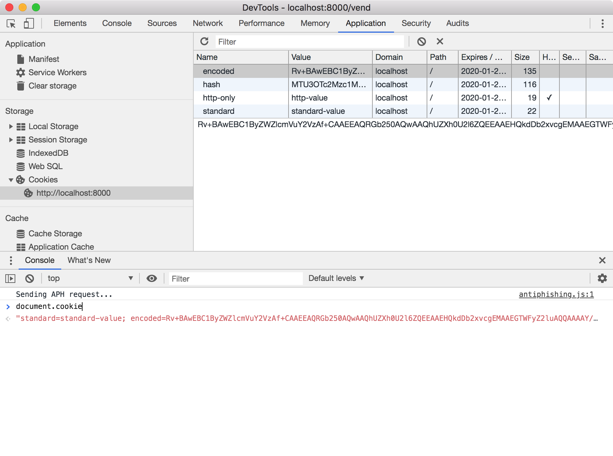

# Web Cookies in Go

A simple recipe for implementing cookies in Go.

This recipe creates and sets 4 different cookies:

| Cookie   | Purpose                                          |
|----------|--------------------------------------------------|
| Simple   | Set a key-value of type string - no restriction. |
| HttpOnly | Cooke works in HTTP only. This is visible to the browser but isn't be accessible from the Javascript. |
| Domain   | Cookie is specific to a domain and won't be visible to the browser if the URL doesn't match the domain. |
| Path     | Cookie is specific to a path and won't be visible to the browser if the URL doesn't match the path. |

The following screenshot shows the result.



## Setup

1. Run the program

   ```bash
   $ go run main.go
   ```
   
1. Open a web browser, open the developer tool/console, and see what cookies are set. Navigate to <http://localhost:8000/vend> and <http://localhost:8000/read>.
   
## Reference

