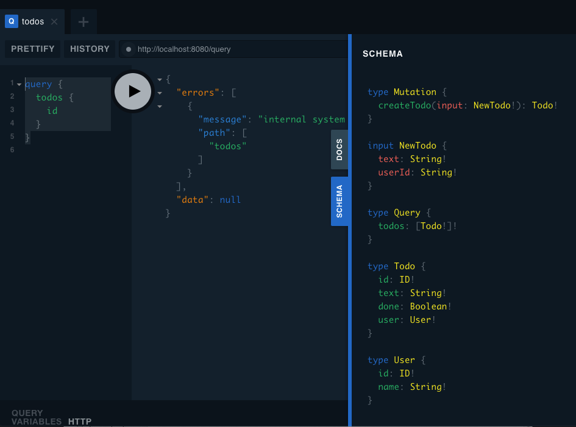

# GraphQL Server in Go

An example of a simple GraphQL server using the [99 Designs GraphQL](https://gqlgen.com/) package. It's basically a regurgitation of the original [gqlgen tutorial](https://gqlgen.com/getting-started/).

## Setup

For this example, we need to follow the steps described here in order to generate code, embed our logic into the generated code, and perform a final build before running the program.

1. To start from scratch, make sure we remove all the generated code.

   ```bash
   $ make clean
   ```

1. Build the skeletal code.

   ```bash
   $ make
   ```

1. The above step generates some boilerplate code and a graphql server with a UI that serves as a playground for our graphql queries.

   ```bash
   $ make run
   $ # Launch a web browser and navigate to http://localhost:8080
   ```

1. Insert following code to `graph/resolver.go`:

   ```go
   package graph

   import (
     "github.com/cybersamx/go-recipes/graphql/server/graph/model"
   )

   // This file will not be regenerated automatically.
   //
   // It serves as dependency injection for your app, add any dependencies you require here.

   type Resolver struct {
     todos []*model.Todo
   }
   ```

   And for `graph/schema.resolvers.go`, insert the following code:

   ```go
   package graph

   // This file will be automatically regenerated based on the schema, any resolver implementations
   // will be copied through when generating and any unknown code will be moved to the end.

   import (
     "context"
     "fmt"
     "math/rand"

     "github.com/cybersamx/go-recipes/graphql/server/graph/generated"
     "github.com/cybersamx/go-recipes/graphql/server/graph/model"
   )

   // CreateTodo is the resolver for the createTodo field.
   func (r *mutationResolver) CreateTodo(ctx context.Context, input model.NewTodo) (*model.Todo, error) {
     todo := &model.Todo{
       Text: input.Text,
       ID:   fmt.Sprintf("T%d", rand.Int()),
       User: &model.User{ID: input.UserID, Name: "user " + input.UserID},
     }
     r.todos = append(r.todos, todo)
     return todo, nil
   }

   // Todos is the resolver for the todos field.
   func (r *queryResolver) Todos(ctx context.Context) ([]*model.Todo, error) {
     return r.todos, nil
   }

   // Mutation returns generated.MutationResolver implementation.
   func (r *Resolver) Mutation() generated.MutationResolver { return &mutationResolver{r} }

   // Query returns generated.QueryResolver implementation.
   func (r *Resolver) Query() generated.QueryResolver { return &queryResolver{r} }

   type mutationResolver struct{ *Resolver }
   type queryResolver struct{ *Resolver }
   ```

1. Run the server.

   ```bash
   $ make run
   ```

   Launch a web browser and navigate to <http://localhost:8080>. You should see the following page. Copy and paste the following query on the browser:

   ```graphql
   query {
     todos {
       id
     }
   }
   ```

   

   We should now get this response:

   ```json
   {
     "data": {
       "todos": []
     }
   }
   ```

   It's empty, so mutate the state (ie. add a TODO) to the server using this. Create another tab, copy and paste the following content, and run the graphql.

   ```graphql
   mutation {
     createTodo(input: {
       text: "hello world",
       userId: "abc-123"
     }) {
       id,
       text
     }
   }
   ```

1. Add the following line to [resolver.go](graph/resolver.go).

   ```go
   //go:generate go run github.com/99designs/gqlgen
   ```

   Next time, we can just run the following command, which instructs the go compiler to run `gqlgen` recursively over the current directory.

   ```bash
   $ go generate ./...
   ```

# Reference

* [gqlgen](https://gqlgen.com/)
