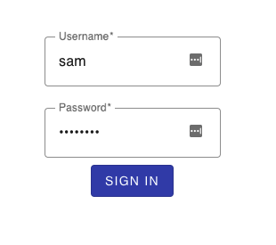

# Advanced Template

The recipe [html-template](../html-template) is fine as a introduction to Go templating. But to use Go temlating in production usually involves some form submission and that the UI needs to look polished. This recipe includes:

* The Material Design Components (MDC) to spiffy the UI. Instead of referencing the MDC from the CDN, this recipe uses the components that are installed locally and uses webpack to build and bundle the MDC into a bundle.
* Submit a form to the Go backend.



## Setup

1. Run the server

   ```bash
   $ make run
   ```

1. Launch a web browser and navigate to <http://localhost:8000>. Use the following credentials to sign in:

  * **username:** sam
  * **password:** password

## Reference

* [Godoc: text/template](https://godoc.org/text/template)
* [Godoc: html/template](https://godoc.org/html/template)
* [Material Design Component](https://material.io)
