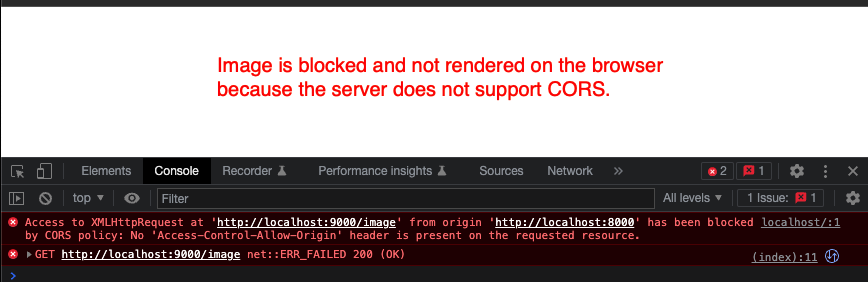
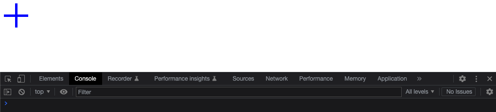

# Cross-Origin Resource Sharing

This example shows the implementation of cors support in an api server using 2 common web frameworks:

* The `gorilla/mux` package.
* The `gin-gonic/gin` package.

### Intro to CORS

### Definitions

| Definition         | Description                                                                                                                            |
|--------------------|----------------------------------------------------------------------------------------------------------------------------------------|
| Origin             | The url of a web client.                                                                                                               |
| Same-origin        | The url, from which the request is fetching the resource is the same url as the web client's url. For example: hello.com -> hello.com. |
| Cross-origin       | The url, from which the request is fetching the resource is different from eh web client's url.                                        |
| Same-origin policy | A policy that forbids a web client from making cross-origin request.                                                                   |

### Cross-Origin URL

By different url, we mean that the url is denoted as different if any of the following host, protocol, and subdomain is different.

| Client URL     | Requesting URL     | Is cross-origin? |
|----------------|--------------------|------------------|
| http://foo.com | http://foo.com     | No               |
| http://foo.com | https://foo.com    | Yes              |
| http://foo.com | http://www.foo.com | Yes              |
| http://foo.com | http://bar.com     | Yes              |

### Flow

Modern day web browsers implements a same-origin policy, which allow a website to fetch resources from the same url as the website, but forbid any resources to fetched or/and rendered from a cross-origin url unless certain conditions are met.

1. When a web browser makes a same-origin request eg. image, there's no special treatment. The request goes straight to the server and the resulting response is received, loaded, and rendered on the browser.
1. When a web browser makes a cross-origin request ie. website = `http://foo.com` but the image url is `http://bar.com`, the web browser will add a header `Origin` with the value of `http://foo.com`.
1. The server of `http://foo.com` recives the cross-origin request. If the server has cors enabled, it should parse the `Origin` header and return a appropriate response. If the originating url is accepted by the server, it returns the image in the body payload and a header called `Access-Control-Allow-Origin` with the value of `http://foo.com`, telling the browser that the cross-origin requests from `http://foo.com` is allowed so go ahead and loaded the response I am going to send you.
1. If the cors-enabled server doesn't have `http://food.com` as its allowed origin, it will return a status code of `403 Forbidden` error.
1. If the server doesn't implement cors at all, it will not return a response with `Access-Control-Allow-Origin`. The browser will refuse to load the response and log an error on the console.

There's a special case when `Access-Control-Allow-Origin` is assigned with a wildcard character `*`. This indicates that the server accepts any url.

## Setup

### Overview

The application runs 2 servers concurrently. The web server serves the `public/index.html` web page on <http://localhost:8000>. The web page sends an async web request to fetch an image from a cross-origin <http://localhost:9000/image>.

### Instructions

To run the cors-supported api server implemented using the `gin` package:

1. Run the server with cors disabled.

   ```shell
   make run-gin
   ```

1. Launch a web browser and navigate to <http://localhost:8000>. The loaded web page will try to load a svg to the web page. Because our image server doesn't implement cors, we see this error on the browser console.

   

1. Restart the server again. This time run the following to enable cors support.

   ```shell
   make run-gin-cors
   ```
1. On your web browser, refresh the web page. This time, the image is successfully rendered on the web page.

   
