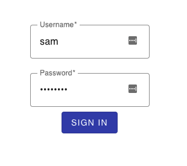

# Advanced Template

We have a recipe called [html-template](../html)
that provides sample code where serve substituted content using Go templates.

However, in production we require more sophistication that includes a more polished UI and form submission.

* The Material Design Components (MDC) to spiffy the UI. Instead of referencing the MDC from the CDN, this recipe uses the components that are installed locally and uses webpack to build and bundle the MDC into a bundle. It includes Go code to serve the webpack.
* Sample code to submit a form.



## Setup

1. Run the server

   ```bash
   $ make run
   ```

1. Launch a web browser and navigate to <http://localhost:8000>. Use the following credentials to sign in:

  * **username:** sam
  * **password:** password

## Reference

* [Godoc: text/template](https://godoc.org/text/template)
* [Godoc: html/template](https://godoc.org/html/template)
* [Material Design Component](https://material.io)
